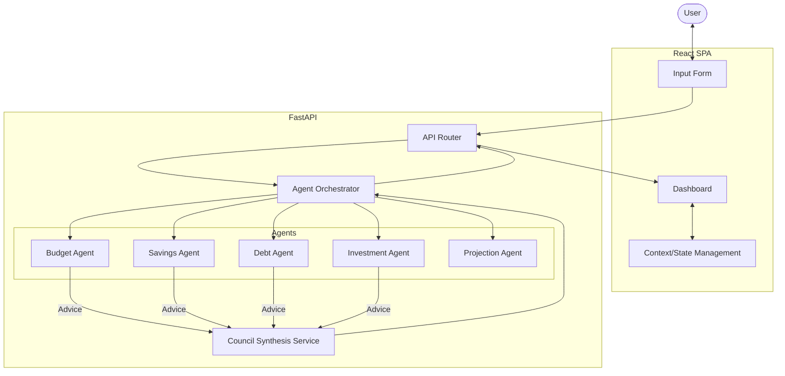

# Money Council - Comprehensive Project Documentation

## 1. Project Overview
**Money Council** is a rule-based multi-agent financial advisory platform designed specifically for students and early-career professionals. The system provides personalized, deterministic, and explainable financial recommendations based on user-provided financial data. It features a modern React frontend for data visualization and a FastAPI backend powered by specialized analysis "Agents."

## 2. Problem Statement
Many students and young professionals struggle with financial literacy and lack access to personalized financial advice. Existing solutions are often either too complex, hide their logic behind "black-box" AI models, or require expensive human consultation. Money Council addresses this by providing a transparent, rule-based system that explains the *why* behind every recommendation.

## 3. Target Users
- **College Students**: Managing pocket money, part-time earnings, and student loans.
- **Early-Career Professionals**: Transitioning to first jobs and establishing financial foundations.
- **Financial Novices**: Users seeking a structured and simple way to start their financial planning journey.

## 4. System Architecture
The system follows a classic **Client-Server Architecture**:

- **Frontend (Client)**: A Single Page Application (SPA) built with React. It handles data collection, client-side validation, and interactive data visualization.
- **Backend (Server)**: A RESTful API built with FastAPI. It handles data validation (Pydantic), orchestrates financial analysis through agents, and synthesizes results.
- **Agent Layer**: A collection of specialized, stateless Python modules that perform targeted financial analysis.

## 5. Technology Stack (with justification)
| Technology | Role | Justification |
| :--- | :--- | :--- |
| **React 18** | Frontend Library | Component-based architecture for reusable UI and efficient state management. |
| **Vite** | Build Tool | Extremely fast development server and optimized production builds. |
| **Chart.js** | Visualization | Lightweight and flexible library for rendering interactive financial charts. |
| **FastAPI** | Backend Framework | High performance, automatic Swagger documentation, and native async support. |
| **Pydantic** | Data Validation | Ensures data integrity and type safety between frontend and backend. |
| **Python 3.8+** | Backend Language | Ideal for data processing and logic-heavy agent modules. |

## 6. Module Breakdown
### Frontend
- **InputForm.jsx**: Dynamic form capturing Income, Expenses (dynamic rows), Debts (dynamic rows), and Risk Tolerance.
- **Dashboard.jsx**: Results display area featuring summarized metrics, visualizations, and the action plan.
- **SummaryCard.jsx**: Atomic UI component for displaying key metrics with visual indicators.
- **CurrencyContext.jsx**: Global state for currency preference (Defaults to INR).
- **StudentModeContext.jsx**: Global state for "Student Mode" which alters logic and UI tips.

### Backend
- **agent_service.py**: Orchestrates the execution of all agents and compilation of results.
- **financial.py (Routes)**: Defines the POST `/analyze` endpoint and handles HTTP communication.
- **council_service.py**: Logic for synthesizing multiple agent outputs into a unified, prioritized action plan.
- **Individual Agents**: (Budget, Savings, Debt, Investment, Projection) described in Section 8.

## 7. Data Flow (Step-by-Step)
1. **Input**: User fills out the `InputForm` with monthly income, a list of expenses (category/amount), a list of debts (name/amount/rate), and risk tolerance.
2. **Validation (Client)**: React checks for non-positive income and missing category names.
3. **Transmission**: Data is sent via a JSON POST request to `http://localhost:8000/api/analyze`.
4. **Validation (Server)**: FastAPI uses Pydantic schemas to validate data types and constraints (e.g., amounts > 0).
5. **Orchestration**: The Orchestrator calculates shared metrics (Disposable Income, Savings Rate, Debt-to-Income Ratio).
6. **Agent Processing**: Each agent (Budget, Savings, Debt, Investment) runs its rule-based logic independently.
7. **Projection**: The Projection Agent calculates forward-looking scenarios based on current and optimized behavior.
8. **Synthesis**: The `Council Service` extracts primary actions and prioritizes them (Debt > Savings > Budget > Investment).
9. **Response**: A comprehensive JSON object containing summary metrics, specific advice, and a unified action plan is returned.
10. **Visualization**: The Frontend maps metrics to `SummaryCards`, creates Chart.js datasets for distribution and projections, and renders the `ActionPlan`.

## 8. Rule-Based Agent Logic (Detailed)

### **Budget Agent**
- **Purpose**: Identify overspending and suggest reduction targets.
- **Inputs**: Income, Expenses Dictionary.
- **Decision Rules**:
    - **Expense Ratio**: (Total Expenses / Income).
    - **Health Check**: < 50% (Excellent), 50-70% (Healthy), 70-85% (Moderate Overspending), > 85% (Severe Overspending).
    - **Logic**: Flags the highest expense category and calculates a reduction target (5-15% of total expenses).
- **Example Scenario**: Income ₹50,000, Rent ₹25,000. Ratio = 50% for one category. Suggests monitoring Rent and optimizing other areas.

### **Savings Agent**
- **Purpose**: Calculate emergency fund adequacy and savings roadmap.
- **Inputs**: Income, Expenses, Current Savings.
- **Decision Rules**:
    - **Emergency Target**: 3x Total Monthly Expenses.
    - **Savings Rate Target**: 20% of Income (default).
    - **Logic**: Calculates the "Funding Gap" and "Months to Goal" based on the 20% savings rate.
- **Example Scenario**: Expenses ₹30,000. Target ₹90,000. Current Savings ₹10,000. Gap ₹80,000. Suggests ₹10,000/month (20% of ₹50k income) to reach goal in 8 months.

### **Debt Agent**
- **Purpose**: Recommend repayment strategies (Avalanche vs. Snowball).
- **Inputs**: List of Debts (Amount, Interest Rate).
- **Decision Rules**:
    - **High Interest Flag**: Debts with interest > 15%.
    - **Avalanche Method**: Used if interest rates are provided (Priority: Highest Rate first).
    - **Snowball Method**: Used if rates are missing (Priority: Lowest Balance first).
- **Example Scenario**: CC Debt ₹10k @ 22%, Student Loan ₹50k @ 8%. Advice: Avalanche - Pay CC first to save maximum interest.

### **Investment Agent**
- **Purpose**: Determine Readiness and asset allocation.
- **Inputs**: Income, Expenses, Savings, Debts, Risk Tolerance.
- **Decision Rules**:
    - **Prerequisites**: 1. Emergency Fund Met (3x expenses) AND 2. No High-interest Debt (> 15%).
    - **Allocation**:
        - **Low Risk**: 70% Index Funds, 20% Bonds, 10% Savings.
        - **Medium Risk**: 40% Index Funds, 30% Mutual Funds, 20% ETFs, 10% Savings.
        - **High Risk**: 30% Index Funds, 30% ETFs, 25% Sectoral Funds, 15% Stocks.
- **Example Scenario**: Debt-free user with ₹1L savings. Recommendation: Ready to Invest. Allocation: Medium Risk profile.

## 9. Scenario Projection Logic
The **Projection Agent** generates comparative data:
- **Current Behavior**: Projects month-over-month growth of current surplus.
- **Optimized Behavior**: Models the impact of reducing expenses by a suggested percentage (5-15%) and increasing savings.
- **Output**: 3-month and 1-year forecasts for total available funds.

## 10. Council Synthesis Strategy
The Council acts as an adjudicator to prevent overwhelming the user:
- **Priority Filtering**: Only 1-2 primary actions from each agent are selected.
- **Conflict Resolution**: If the user has high debt, the "Investment" advice is demoted or converted to a prerequisite warning.
- **Milestone Generation**: Breaks the long-term plan into Month 1 (Start), Month 3 (Review), and Month 6 (Pivot) checkpoints.

## 11. Frontend Design & State Management
- **Responsive Layout**: Uses flexbox and CSS grids for cross-device compatibility.
- **Visual Feedback**: Priority color-coding (Red: High, Yellow: Medium, Green: Low).
- **State Persistence**: Uses `sessionStorage` to allow dashboard persistence across browser refreshes during a session.
- **Context API**: Manages global settings like `currency` and `studentMode` without prop-drilling.

## 12. API Design & Endpoints
- **POST `/api/analyze`**: Primary endpoint. Accepts `FinancialInputRequest` and returns `ExtendedAnalysisResponse`.
- **Validation**: Automatic 422 Unprocessable Entity responses for invalid types.
- **Documentation**: Access `/docs` for Swagger UI.

## 13. Currency & Student Mode Features
- **Currency**: Primary support for Indian Rupee (₹) using `en-IN` locale for formatting.
- **Student Mode**:
    - Reduces the target "Savings Rate" to 10-15% (reflecting lower student income capacity).
    - Injects educational tips: "Set savings targets", "Track food delivery", "Search for discounts".

## 14. Security & Privacy Considerations
- **No Persistence**: The prototype does not use a database; data exists only during the request lifecycle and session storage.
- **No PII**: The system does not ask for names, bank account numbers, or IDs.
- **CORS**: Configured to restrict requests from unrecognized frontend origins in production.

## 15. Design Decisions & Trade-offs
- **Rule-Based over ML**: Chosen for 100% explainability, which is critical for an educational college project.
- **Stateless Backend**: Simplifies scaling and testing, though it requires the frontend to manage more session state.
- **Vanilla CSS**: Used over Tailwind for maximum design flexibility and reduced dependency bloat in this specific project.

## 16. Limitations of the Prototype
- **No Persistent Accounts**: User data is lost once the browser session ends.
- **Limited Categories**: Expense analysis relies on categorical naming which can be subjective.
- **Manual Input**: Relies on user accuracy for amounts and interest rates.

## 17. Future Enhancements
- **Database Integration**: For tracking progress over time.
- **SMS/Email Alerts**: Automated reminders for debt payments.
- **Stock API Integration**: Real-time ticker tracking for recommended investment sectors.
- **User Authentication**: Secure Login/Signup.

## 18. Comparison with Existing Solutions
Unlike banking apps that just show balance, or generic budget apps that track spending, **Money Council** provides a "Council" of experts that tell you the next logical step based on a mathematical priority (Debt Clearance > Emergency Fund > Wealth Building).

## 19. Demo Walkthrough (Input → Output)
1. **Input**: User enters Income ₹40,000, Rent ₹15,000, Food ₹10,000, Credit Card debt ₹5,000 @ 20%.
2. **Dashboard**: 
   - Summary: Disposable Income ₹15,000.
   - Charts: Shows that 62% of income goes to essentials.
   - **Action Plan**:
     1. **Priority 1 (High)**: Pay off ₹5,000 Credit Card debt immediately (interest is too high).
     2. **Priority 2 (Medium)**: Save ₹8,000/month (20%) for an Emergency Fund target of ₹75,000.
     3. **Priority 3 (Low)**: Optimize food spending.
